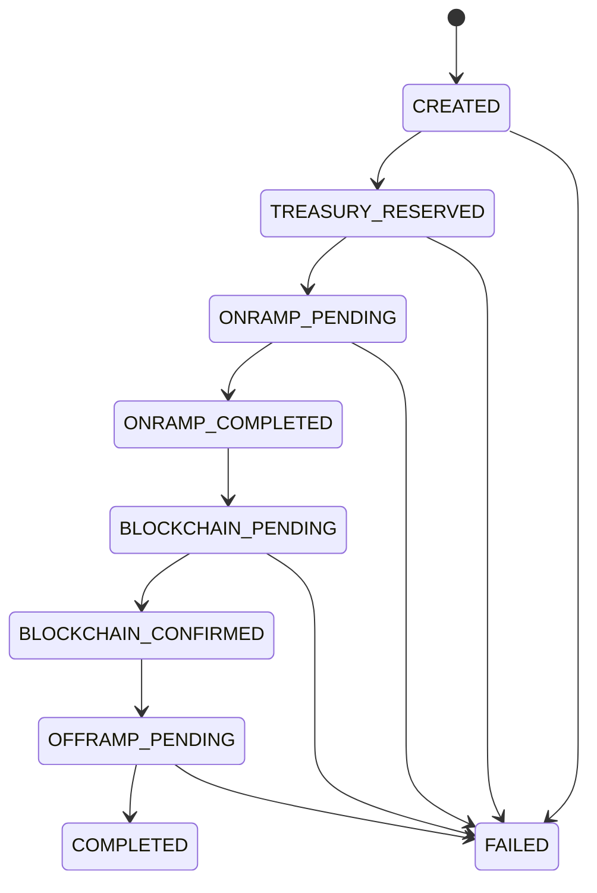

# Transfers

A transfer represents a cross-border payment from one currency to another via stablecoin rails.

## State Machine

Every transfer follows a deterministic state machine. States can only advance forward — there is no going back.

## State Descriptions

| State | What's Happening |
|-------|-----------------|
| `CREATED` | Transfer accepted. Quote validated, idempotency key checked. |
| `TREASURY_RESERVED` | Funds locked in treasury. No double-spend possible. |
| `ONRAMP_PENDING` | Fiat is being converted to stablecoins via the on-ramp provider. |
| `ONRAMP_COMPLETED` | Stablecoins acquired and in Settla's custody. |
| `BLOCKCHAIN_PENDING` | On-chain stablecoin transfer submitted. |
| `BLOCKCHAIN_CONFIRMED` | On-chain transfer confirmed (sufficient block confirmations). |
| `OFFRAMP_PENDING` | Stablecoins being converted to destination fiat. |
| `COMPLETED` | Recipient has received funds. Terminal state. |
| `FAILED` | Transfer failed. Check events for the failure reason. Terminal state. |

## Idempotency

Every transfer creation requires an `idempotency_key`. If the same key is submitted twice:
- The second request returns the existing transfer (not a new one)
- No duplicate funds are moved
- The response is identical to the original

## Events

Each state transition generates an event. Query events via `GET /v1/transfers/:id/events` to see the full history including timestamps, metadata, and failure reasons.
