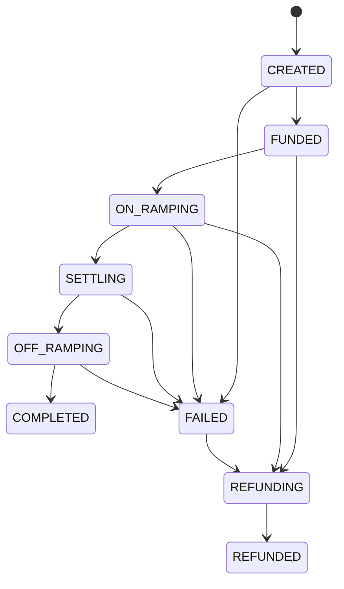

# Transfers

A transfer represents a cross-border payment from one currency to another via stablecoin rails.

## State Machine

Every transfer follows a deterministic state machine. States can only advance forward — there is no going back (except through the compensation/refund path).



## State Descriptions

| State | What's Happening |
|-------|-----------------|
| `CREATED` | Transfer accepted. Quote validated, idempotency key checked. |
| `FUNDED` | Treasury funds reserved atomically. No double-spend possible. |
| `ON_RAMPING` | Source fiat is being converted to stablecoins via the on-ramp provider. |
| `SETTLING` | Stablecoins are being transferred on-chain (Tron, Ethereum, etc.). |
| `OFF_RAMPING` | Stablecoins are being converted to destination fiat via the off-ramp provider. |
| `COMPLETED` | Recipient has received funds. Terminal success state. |
| `FAILED` | Transfer encountered an unrecoverable error. Check events for details. |
| `REFUNDING` | Compensation/refund in progress (triggered by failure or cancellation). |
| `REFUNDED` | Refund completed. Terminal state. |

## Valid Transitions

```
CREATED    → FUNDED, FAILED
FUNDED     → ON_RAMPING, REFUNDING
ON_RAMPING → SETTLING, REFUNDING, FAILED
SETTLING   → OFF_RAMPING, FAILED
OFF_RAMPING→ COMPLETED, FAILED
FAILED     → REFUNDING
REFUNDING  → REFUNDED
```

## Idempotency

Every transfer creation requires an `idempotency_key`. If the same key is submitted twice:
- The second request returns the existing transfer (not a new one)
- No duplicate funds are moved
- The response is identical to the original

Keys are valid for 2 hours and scoped per-tenant: `UNIQUE(tenant_id, idempotency_key)`.

## Events

Each state transition generates an event. Query events via `GET /v1/transfers/:id/events` to see the full history including timestamps, provider references, and failure reasons.

### Example Timeline

A successful GBP→NGN transfer:

| Time | From | To | Details |
|------|------|-----|---------|
| T+0s | — | CREATED | Transfer submitted, quote validated |
| T+1s | CREATED | FUNDED | GBP 1,000 reserved from treasury |
| T+2s | FUNDED | ON_RAMPING | On-ramp provider converting GBP→USDT |
| T+8s | ON_RAMPING | SETTLING | USDT sent on Tron chain |
| T+12s | SETTLING | OFF_RAMPING | Off-ramp converting USDT→NGN |
| T+18s | OFF_RAMPING | COMPLETED | NGN 520,000 delivered to recipient |

## Compensation

When a transfer fails after funds have been reserved or processed:
1. The engine selects a compensation strategy (SIMPLE_REFUND, REVERSE_ONRAMP, CREDIT_STABLECOIN, or MANUAL_REVIEW)
2. The transfer moves to `REFUNDING` state
3. Compensation actions execute automatically
4. On success, the transfer reaches `REFUNDED` state
5. If compensation fails, the transfer is escalated to manual review
