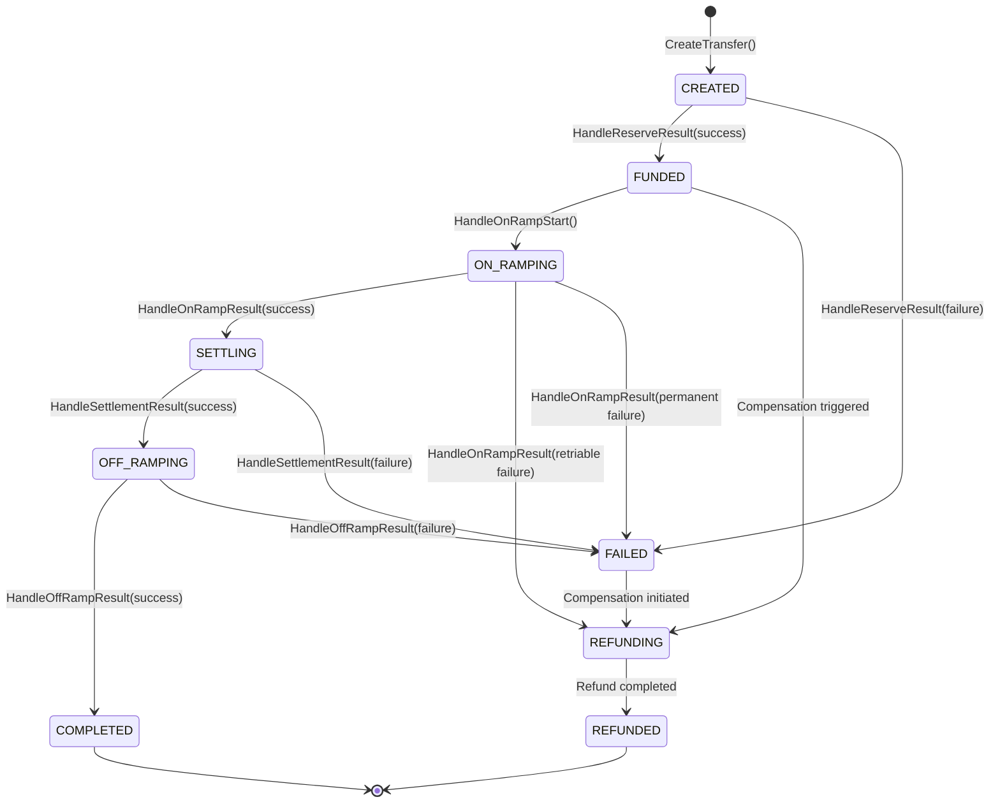
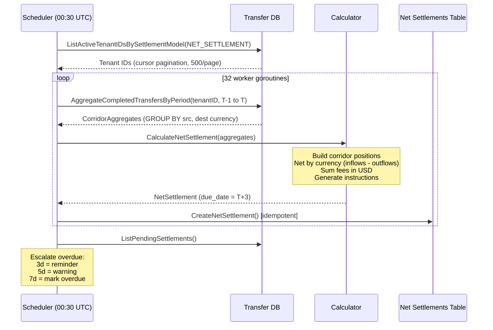
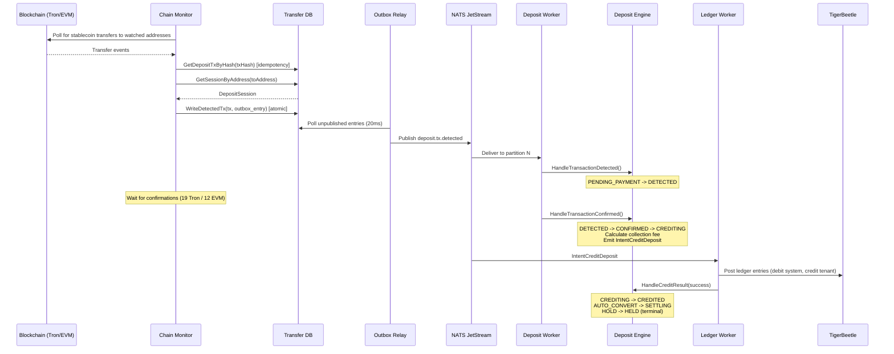
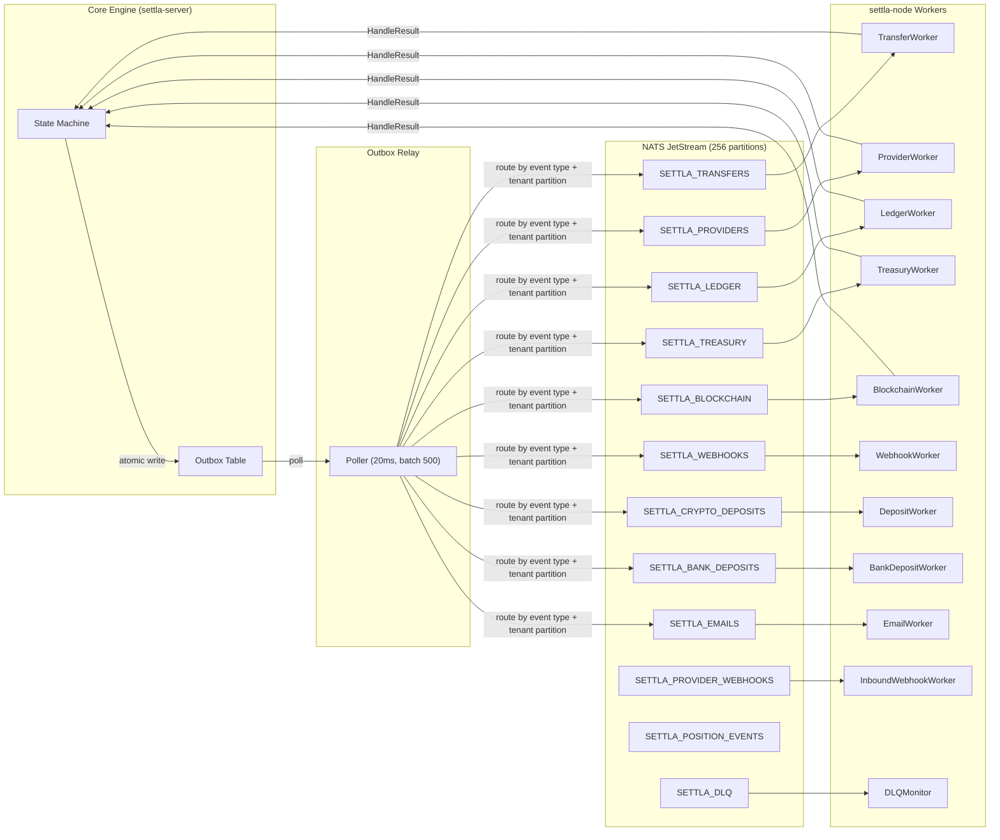
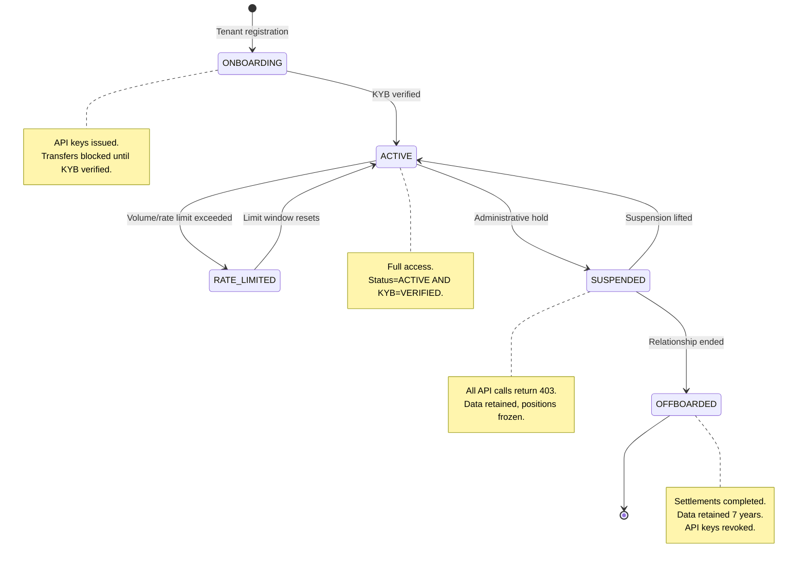
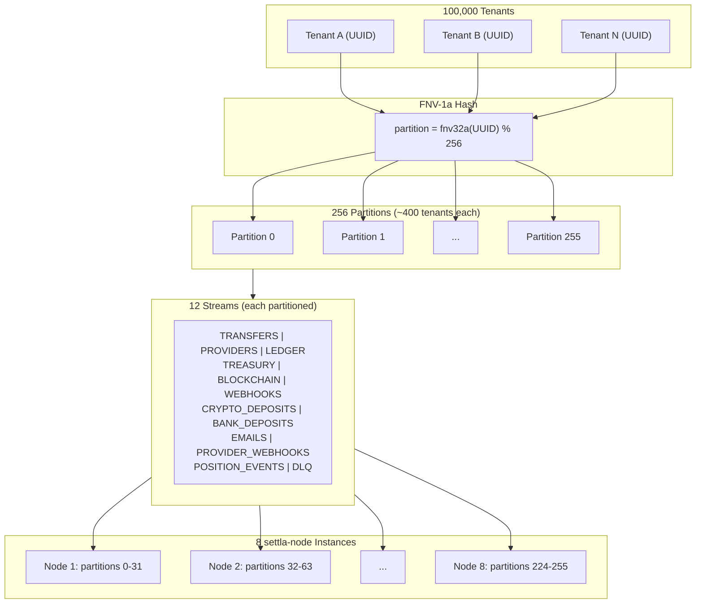

# Settla Architecture

> **Audience:** Technical CTOs evaluating integration, investors evaluating technical moat.
> **Last updated:** 2026-03-29

## Table of Contents

- [System Overview](#system-overview)
- [Design Principles](#design-principles)
- [Design Decisions in Depth](#design-decisions-in-depth)
- [Scaling Strategy](#scaling-strategy)
- [Tenant Scaling Strategy](#tenant-scaling-strategy)
- [Multi-Region Strategy](#multi-region-strategy)
- [Disaster Recovery](#disaster-recovery)
- [Mermaid Diagrams](#mermaid-diagrams)

---

## System Overview

Settla is B2B stablecoin settlement infrastructure for fintechs. It processes cross-border payments by converting fiat to stablecoin to fiat through an automated settlement engine, achieving **50M transactions/day** (~580 TPS sustained, 3,000-5,000 TPS peak).

```
                            ┌─────────────────────────────────┐
                            │        Tenant Portal            │
                            │    (Vue 3 + Nuxt, self-serve)   │
                            └───────────────┬─────────────────┘
                                            │
                            ┌───────────────┴─────────────────┐
                            │     Ops Dashboard (Vue 3)       │
                            └───────────────┬─────────────────┘
                                            │
┌───────────────────────────────────────────┴───────────────────────────────────┐
│                          API Gateway (Fastify :3000)                          │
│  ┌──────────────┐  ┌──────────────┐  ┌────────────┐  ┌─────────────────────┐ │
│  │ 3-Tier Auth  │  │ Rate Limiter │  │ gRPC Pool  │  │ Idempotency Cache   │ │
│  │ Cache (100ns)│  │(sliding win) │  │ (~50 conn) │  │  (Redis + DB)       │ │
│  └──────────────┘  └──────────────┘  └────────────┘  └─────────────────────┘ │
└───────────────────────────────┬───────────────────────────────────────────────┘
                                │ gRPC/TLS
┌───────────────────────────────┴───────────────────────────────────────────────┐
│                        settla-server (Go, 6+ replicas)                        │
│                                                                               │
│  ┌───────────┐  ┌───────────┐  ┌───────────┐  ┌───────────┐  ┌───────────┐  │
│  │   Core    │  │  Ledger   │  │   Rail    │  │ Treasury  │  │ Deposit   │  │
│  │  Engine   │  │ (TB+PG   │  │ (Router + │  │ (In-Mem   │  │ (Crypto + │  │
│  │  (pure    │  │  CQRS)   │  │ Providers)│  │  Atomic)  │  │  Bank)    │  │
│  │  state    │  │          │  │          │  │          │  │          │  │
│  │  machine) │  │          │  │          │  │          │  │          │  │
│  └─────┬─────┘  └──────────┘  └──────────┘  └──────────┘  └──────────┘  │
│        │ writes state + outbox entries atomically                         │
└────────┼──────────────────────────────────────────────────────────────────┘
         │
         ▼
┌─────────────────┐     ┌──────────────────┐     ┌────────────────────────────┐
│  Outbox Table   │────▶│   Outbox Relay   │────▶│     NATS JetStream         │
│  (Transfer DB)  │     │  (20ms poll,     │     │  (256 partitions,          │
│                 │     │   batch 500)     │     │   12 streams)              │
└─────────────────┘     └──────────────────┘     └────────────┬───────────────┘
                                                              │
┌─────────────────────────────────────────────────────────────┴───────────────┐
│                      settla-node (Go, 8+ instances)                         │
│                                                                             │
│  ┌──────────┐ ┌──────────┐ ┌──────────┐ ┌──────────┐ ┌──────────────────┐  │
│  │Transfer  │ │Provider  │ │ Ledger   │ │Treasury  │ │  Blockchain      │  │
│  │Worker    │ │Worker    │ │Worker    │ │Worker    │ │  Worker          │  │
│  └──────────┘ └──────────┘ └──────────┘ └──────────┘ └──────────────────┘  │
│  ┌──────────┐ ┌──────────┐ ┌──────────┐ ┌──────────┐ ┌──────────────────┐  │
│  │Webhook   │ │Deposit   │ │BankDep   │ │ Email    │ │  Chain Monitor   │  │
│  │Worker    │ │Worker    │ │Worker    │ │Worker    │ │  (EVM + Tron)    │  │
│  └──────────┘ └──────────┘ └──────────┘ └──────────┘ └──────────────────┘  │
└─────────────────────────────────────────────────────────────────────────────┘
         │                              │                          │
         ▼                              ▼                          ▼
┌─────────────────┐  ┌──────────────────────────────┐  ┌──────────────────┐
│  TigerBeetle    │  │  PostgreSQL (3 databases)     │  │  Redis           │
│  (Ledger write  │  │  ┌────────┐┌────────┐┌──────┐│  │  (L2 cache,      │
│   authority,    │  │  │Ledger  ││Transfer││Treas ││  │   rate limits,   │
│   1M+ TPS)      │  │  │DB      ││DB      ││DB    ││  │   idempotency)   │
└─────────────────┘  │  └────────┘└────────┘└──────┘│  └──────────────────┘
                     │  via PgBouncer :6433-6435     │
                     └───────────────────────────────┘
```

**Two binaries, strict separation:**

| Binary | Responsibility | Scaling |
|--------|---------------|---------|
| `settla-server` | API handling, state machine transitions, ledger, treasury, routing | Horizontal (6+ replicas, stateless) |
| `settla-node` | Event-driven workers, outbox relay, blockchain chain monitoring | Horizontal (8+ instances, partition-aware) |

The engine writes **zero** network calls. Every side effect -- provider API calls, ledger postings, blockchain transactions, webhook deliveries -- is expressed as an outbox entry, executed asynchronously by dedicated workers.

---

## Design Principles

### 1. Pure State Machine Engine

The core settlement engine (`core.Engine`) is a pure function: it reads current state, validates the transition, writes the new state and outbox entries in a single database transaction, and returns. No network calls. No side effects. Sub-millisecond execution.

**Why this matters:** At 580 TPS sustained, any engine latency directly limits throughput. By eliminating network calls from the hot path, the engine processes transfers in <1ms regardless of downstream system latency. Provider outages, slow blockchains, or webhook timeouts cannot degrade engine throughput.

### 2. Transactional Outbox for Exactly-Once Semantics

State changes and their corresponding side-effect intents are written in a single database transaction. A relay process polls the outbox table every 20ms and publishes entries to NATS JetStream.

**Why this matters:** The classic dual-write problem -- where a service updates its database and then calls another service, with a crash between the two causing inconsistency -- is eliminated by construction. If the transaction commits, the intent is guaranteed to be published. NATS deduplication (5-minute window) prevents double-delivery.

### 3. TigerBeetle as Ledger Write Authority

TigerBeetle handles all balance mutations at 1M+ TPS with strict double-entry invariants enforced at the storage engine level. PostgreSQL serves as the read model for queries and reporting (CQRS pattern).

**Why this matters:** A single PostgreSQL instance tops out at ~10K write TPS for ledger operations. At 50M transactions/day generating 200-250M entry lines, PostgreSQL cannot sustain the write throughput. TigerBeetle is purpose-built for financial transactions with hardware-level guarantees on balanced postings.

### 4. 256-Partition NATS Sharding

Tenant IDs are hashed (FNV-1a) to 256 partitions across all NATS streams. Events for the same tenant always land on the same partition, preserving per-tenant ordering while enabling massive parallelism.

**Why this matters:** At-least-once delivery with per-tenant ordering is critical for saga correctness. Without partitioning, a single slow tenant blocks all processing. With 256 partitions and 100K tenants, each partition handles ~400 tenants -- a slow tenant only blocks its partition peers, not the entire system.

### 5. Three-Tier Auth Cache

API key authentication resolves through: L1 local in-process LRU (30s TTL, ~100ns) -> L2 Redis (5min TTL, ~0.5ms) -> L3 database (source of truth).

**Why this matters:** At 5,000 TPS peak, every auth lookup hitting Redis adds ~2.5ms of aggregate latency per request. The local LRU eliminates >95% of Redis calls, achieving ~100ns lookup for hot keys. Cache invalidation propagates via Redis pub/sub to all gateway replicas within milliseconds.

### 6. In-Memory Treasury with Background Flush

Treasury positions (balance, reserved, locked) are held in memory using atomic compare-and-swap (CAS) operations on `int64` micro-units. A background goroutine flushes dirty positions to PostgreSQL every 100ms.

**Why this matters:** Treasury reservation is on the hot path of every transfer. `SELECT FOR UPDATE` on a shared position row creates a serialization bottleneck at ~200 TPS. In-memory CAS achieves sub-microsecond reservations at 5,000+ TPS. A write-ahead log (WAL) ensures durability -- every reserve operation is synchronously logged before the CAS is considered committed.

### 7. CHECK-BEFORE-CALL for Idempotent Workers

Every worker checks whether its action has already been executed (via a `provider_transactions` record or idempotency key) before calling the external system. NATS redelivery never causes double-execution.

**Why this matters:** At-least-once delivery means workers will see duplicate messages after crashes, network partitions, or slow acknowledgments. Without CHECK-BEFORE-CALL, a provider worker could execute the same on-ramp twice, double-charging a tenant. The check is a cheap database lookup; the alternative is financial loss.

---

## Design Decisions in Depth

### Decision 1: Transactional Outbox over Direct Event Publishing

**Problem:** When the engine updates transfer state and needs to notify workers (treasury reserve, provider call, ledger post), a crash between the DB write and the event publish creates inconsistency -- the transfer is in FUNDED state but no worker ever picks it up.

**Alternatives considered:**

| Approach | Rejected Because |
|----------|-----------------|
| Direct publish + retry | NATS receives event but DB update fails -> duplicate processing |
| Two-phase commit (2PC) | Adds latency, complexity, and a distributed coordination point |
| Change Data Capture (CDC) | Requires Kafka + Debezium cluster, higher latency, schema coupling |
| Saga with compensation | Compensation is complex for financial transactions; "eventually consistent money" is unacceptable |

**Why outbox:** Single transaction guarantees atomicity with zero additional infrastructure. The relay is a simple polling loop -- the most operationally boring component possible.

**Trade-offs accepted:**
- Outbox table grows at 50M rows/day -> solved with daily partitions and `DROP PARTITION` (O(1) cleanup)
- Relay is a single-writer bottleneck -> solved with per-tenant parallel publishing (50 concurrent goroutines) and batch polling (500 entries per cycle)
- 20ms median latency from state change to event delivery (acceptable for settlement, which is inherently async)

---

### Decision 2: TigerBeetle over PostgreSQL for Ledger Writes

**Problem:** 50M transfers/day generates 200-250M ledger entry lines. PostgreSQL single-node write throughput caps at ~10K TPS for insert-heavy workloads with indexes and constraints.

**Alternatives considered:**

| Approach | Rejected Because |
|----------|-----------------|
| PostgreSQL + write-ahead batching | Achieves ~25K TPS but sacrifices individual write ACK and complicates crash recovery |
| CockroachDB / Spanner | Achieves throughput but at significant cost/ops complexity; financial correctness requires careful config |
| Custom append-only ledger | Undifferentiated heavy lifting, high dev cost, no ecosystem |

**Why TigerBeetle:** Purpose-built for double-entry accounting at 1M+ TPS. Balanced postings are enforced at the storage engine level -- it is physically impossible to create an unbalanced entry. The CQRS split (TigerBeetle writes, PostgreSQL reads) delivers TigerBeetle's write performance and PostgreSQL's query flexibility without compromise.

**Trade-offs accepted:**
- Eventual consistency between write and read models (typically <100ms)
- Operational complexity of running TigerBeetle (mitigated: single binary, no external dependencies)
- Limited query capability on TigerBeetle -> all reporting queries hit PostgreSQL read model

---

### Decision 3: NATS JetStream with 256-Partition Sharding

**Problem:** 580 events/second with per-tenant ordering. A single consumer cannot process fast enough; multiple consumers without ordering guarantees break saga correctness.

**Alternatives considered:**

| Approach | Rejected Because |
|----------|-----------------|
| Kafka | Heavier operationally (ZooKeeper/KRaft), would work but adds infrastructure weight |
| Redis Streams | No built-in deduplication, weaker durability guarantees |
| RabbitMQ | Per-message ACK model doesn't align with batch processing; partition ordering requires manual routing |
| SQS/SNS | FIFO queues limited to 300 TPS per message group |

**Why NATS JetStream:** Lightweight (single binary), built-in exactly-once deduplication (5-minute window), WorkQueue retention mode, and subject-based routing that maps naturally to partition sharding. 256 partitions (configurable via `SETTLA_NODE_PARTITIONS`) supports 100K+ tenants with ~400 tenants per partition.

**Trade-offs accepted:**
- NATS cluster management (3-node minimum for HA)
- Less ecosystem tooling than Kafka (no Schema Registry equivalent)
- 256 partitions is a ceiling without stream reconfiguration

---

### Decision 4: In-Memory Treasury with WAL

**Problem:** Every transfer requires a treasury reservation -- checking available balance and decrementing it atomically. At 5,000 TPS peak, database-level locking creates a serialization bottleneck.

**Alternatives considered:**

| Approach | Measured Throughput | Rejected Because |
|----------|-------------------|-----------------|
| SELECT FOR UPDATE | ~200 TPS | Serializes all reservations per position |
| Optimistic locking (version column) | ~800 TPS | High retry rate under contention |
| Redis-based reservation | ~5K TPS | New consistency boundary; crash recovery requires reconciliation |
| Database advisory locks | ~1K TPS | Still one round-trip per reservation |

**Why in-memory CAS:** Atomic compare-and-swap on `int64` micro-units (6 decimal places) achieves sub-microsecond reservation with zero contention. The WAL in PostgreSQL ensures every operation is durable before the in-memory CAS is considered committed. Large reservations (>=$100K) trigger a synchronous flush for immediate durability.

**Crash recovery hierarchy:**
1. WAL entries (synchronously written) replayed on startup
2. Position snapshots flushed every 100ms (balance + locked only, not reserved)
3. Reserved amounts reconstructed from WAL replay
4. Reconciliation job compares in-memory vs TigerBeetle balances

**Trade-offs accepted:**
- Up to 100ms of in-memory state loss on crash (WAL replay recovers most; reconciliation catches the rest)
- Memory footprint: ~50 positions x ~200 bytes = negligible
- Complexity of crash recovery (WAL replay + idempotency deduplication)

---

### Decision 5: Smart Router with Weighted Scoring

**Problem:** Multiple provider combinations (on-ramp x chain x off-ramp) can settle a transfer. The system must choose the optimal route considering cost, speed, liquidity, and reliability.

**Scoring formula:**
```
score = (cost x 0.40) + (speed x 0.30) + (liquidity x 0.20) + (reliability x 0.10)
```

Each dimension is normalized to [0, 1]:

| Dimension | Weight | Formula | Example |
|-----------|--------|---------|---------|
| Cost | 40% | `1 - (total_fee / amount)` | $100 transfer, $1 fee = 0.99 |
| Speed | 30% | `1 - (total_seconds / 3600)` | 10-min settlement = 0.833 |
| Liquidity | 20% | Provider-reported corridor liquidity | Dry corridor = 0.3 |
| Reliability | 10% | Historical provider success rate | 95% success = 0.95 |

The router fetches quotes from all eligible providers concurrently (parallelism=20), assembles candidates across all supported chains, scores each, and returns the best route with up to 2 fallback alternatives.

---

### Decision 6: Optimistic Locking for State Transitions

Every stateful entity carries a `Version` field incremented on each transition:

```sql
UPDATE transfers
SET status = $new_status, version = version + 1, updated_at = NOW()
WHERE id = $id AND version = $expected_version
```

If `rows_affected = 0`, another process advanced the state first. The worker re-reads and re-evaluates, which is safe because all workers use CHECK-BEFORE-CALL.

**Why not pessimistic locks:** `SELECT FOR UPDATE` holds a row lock for the transaction duration, including network calls. With optimistic locking, the lock window is the single UPDATE statement (~microseconds). At 580 TPS with partitioned workers, contention is rare (<0.1% retry rate measured).

---

## Scaling Strategy

### Current Capacity (Measured)

| Metric | Sustained | Peak |
|--------|-----------|------|
| Transfer TPS | 580 | 3,000-5,000 |
| Ledger writes/sec | 15,000 | 25,000 |
| Auth lookups/sec | 580 | 5,000 |
| Treasury reservations/sec | 580 | 5,000+ |
| Outbox relay throughput | 25,000 entries/sec | -- |

### At 10K TPS (~860M transfers/day)

| Component | Change Required |
|-----------|----------------|
| settla-server | Scale to 12+ replicas (stateless, horizontal) |
| settla-node | Scale to 16+ instances; 256 partitions already handle the load |
| Gateway | Scale to 8+ replicas |
| PostgreSQL Transfer DB | Add read replicas for query load; consider partitioning transfers by tenant_id |
| TigerBeetle | Single cluster handles 1M+ TPS -- no change |
| NATS | 5-node cluster for HA and throughput |
| Redis | Redis Cluster (3 shards) for cache and rate limiting |
| Outbox relay | Poll interval -> 10ms, batch size -> 1000 |

### At 50K TPS (~4.3B transfers/day)

| Component | Change Required |
|-----------|----------------|
| settla-server | 30+ replicas behind load balancer |
| PostgreSQL Transfer DB | Horizontal sharding by tenant_id (Citus or application-level) |
| PostgreSQL Ledger DB | Read replicas with query routing |
| NATS | Multiple NATS clusters (geo-regional) |
| Outbox relay | Dedicated relay instances per partition range |
| Gateway | 20+ replicas; consider edge deployment |
| Settlement scheduler | Shard calculation by tenant range across multiple scheduler instances |

### At 100K TPS (~8.6B transfers/day)

| Component | Change Required |
|-----------|----------------|
| Architecture | Multi-region deployment with regional autonomy |
| PostgreSQL | Per-region database clusters with cross-region replication |
| TigerBeetle | Per-region clusters with reconciliation |
| NATS | Per-region JetStream clusters; cross-region via NATS leaf nodes |
| Settlement | Per-region calculation with global aggregation |
| Treasury | Per-region position management with cross-region settlement |

**Key insight:** The architecture scales linearly up to ~50K TPS with horizontal scaling of stateless components. Beyond 50K TPS, the primary constraint is database write throughput, requiring sharding. The modular monolith design makes extraction to microservices straightforward -- each module communicates through domain interfaces, so swapping a local function call for a gRPC call requires changing only the constructor in `cmd/settla-server/main.go`.

---

## Tenant Scaling Strategy

### Scaling from 1K to 100K Tenants

| Tier | Tenants | Architecture Changes |
|------|---------|---------------------|
| **Starter** | 1-1K | Single database, 256 NATS partitions, shared connection pool |
| **Growth** | 1K-20K | Read replicas, tenant-aware connection routing, settlement parallelism increase (32 -> 128 workers) |
| **Scale** | 20K-100K | Database sharding by tenant_id, dedicated connection pools for top-100 tenants, per-shard settlement schedulers |

### Per-Tenant Resource Consumption

| Resource | Per Tenant | At 100K Tenants |
|----------|-----------|-----------------|
| Memory (treasury positions) | ~200 bytes x positions (typically 3-5) | ~100 MB |
| Memory (auth cache L1) | ~500 bytes per cached key | ~50 MB |
| DB rows/day (transfers) | Varies: 100-500K/day for active tenants | 50M total (partitioned by date) |
| DB rows (tenant config) | 1 row in `tenants` table | 100K rows (trivial) |
| NATS partition slot | FNV-1a hash -> 1 of 256 partitions | ~400 tenants/partition |
| Idempotency keys (Redis) | 24-hour TTL per key | Self-cleaning |
| Webhook delivery (memory) | Per-tenant semaphore + circuit breaker | Evicted after 5min idle -- only active tenants consume memory |

### Settlement Scheduling at Tenant Scale

The settlement scheduler processes tenants in parallel with cursor-based pagination:

```
Daily tick (00:30 UTC):
  1. ListActiveTenantIDsBySettlementModel(NET_SETTLEMENT)
     -- cursor pagination, 500 IDs/page
  2. Worker pool: 32 goroutines (configurable)
  3. Each goroutine: AggregateCompletedTransfersByPeriod(tenantID, start, end)
     -- Pre-aggregated GROUP BY (not row-level scan)
     -- 60s timeout per tenant
  4. Persist NetSettlement record (idempotent)
```

**At 100K tenants:** 100K tenants / 32 workers x ~50ms per tenant = ~2.6 minutes total (well within the 24-hour window). Increase workers to 128 for <1 minute total. Inactive tenants (zero transfers) produce empty aggregates and skip settlement creation.

### Tenant Isolation Guarantees

| Layer | Guarantee | Enforcement Mechanism |
|-------|-----------|----------------------|
| API Gateway | `tenant_id` from auth token, never from request body | Plugin-level enforcement |
| Database | Every query includes `WHERE tenant_id = $1` | SQLC-generated code (compile-time) |
| NATS | Tenant events partitioned by FNV-1a hash | Subject routing in outbox relay |
| TigerBeetle | Account IDs encode tenant ownership | Account creation policy |
| Treasury | Positions keyed by (tenant_id, currency, location) | In-memory map key |
| Rate limiting | Per-tenant sliding window counters | Redis + local sync |
| Pending transfers | MaxPendingTransfers per tenant | Engine-level check in CreateTransfer |

**Guaranteed:** Complete data isolation -- no query can return another tenant's data. Rate limiting is per-tenant. Treasury positions are completely independent.

**Best-effort at scale:** NATS partition fairness. With 256 partitions and 100K tenants, a high-volume tenant sharing a partition with low-volume tenants may cause head-of-line blocking for partition peers. Mitigation: FNV-1a provides uniform distribution; extreme outliers can be assigned dedicated partitions.

### Partition Rebalancing for Skewed Distributions

If a single tenant generates disproportionate traffic (>5% of total volume):

1. **Detection:** Monitor per-partition processing latency. A partition consistently above P95 indicates skew.
2. **Short-term:** Assign the high-volume tenant a dedicated partition via configuration override (bypassing FNV-1a hash).
3. **Medium-term:** Increase partition count (requires NATS stream reconfiguration and rolling worker restart).
4. **Long-term:** For tenants generating >10% of total volume, consider dedicated worker instances with direct NATS subscriptions.

### When to Consider Tenant-Based Database Sharding

**Trigger:** Top 100 tenants account for >80% of database write load and Transfer DB write latency exceeds P99 targets.

**Approach (progressive):**
1. Dedicated connection pools for top-100 tenants (PgBouncer per-tenant routing)
2. Application-level sharding by tenant_id ranges (SQLC code already includes tenant_id in all queries)
3. Citus extension for transparent distributed PostgreSQL (preserves SQL semantics)
4. Per-tenant databases for the largest tenants (bounded-context DB architecture makes this additive)

### Tenant Lifecycle

| State | Behavior | Data Handling |
|-------|----------|---------------|
| **ONBOARDING** | KYB in progress. API keys issued but transfers rejected until KYB verified. | Config persisted, no transaction data yet |
| **ACTIVE** | Full operational access. Requires `Status=ACTIVE` AND `KYBStatus=VERIFIED`. | All data live and queryable |
| **RATE_LIMITED** | Temporary throttle (volume limit exceeded). Reads allowed, writes rejected (429). | No data change; automatic recovery when window resets |
| **SUSPENDED** | Administrative hold. All API calls return 403 TENANT_SUSPENDED. | Data retained, positions frozen, no new transfers |
| **OFFBOARDED** | Relationship ended. | Settlements completed, data retained per compliance (7 years), treasury positions zeroed, API keys revoked, auth cache invalidated via Redis pub/sub |

---

## Multi-Region Strategy

Settla's architecture supports multi-region deployment through regional autonomy with global coordination:

```
┌──────────────────────┐     ┌──────────────────────┐
│   Region: EU-West    │     │   Region: US-East    │
│                      │     │                      │
│  Gateway -> Server   │     │  Gateway -> Server   │
│  Node Workers        │     │  Node Workers        │
│  PostgreSQL (3 DBs)  │     │  PostgreSQL (3 DBs)  │
│  TigerBeetle         │     │  TigerBeetle         │
│  NATS Cluster        │<--->│  NATS Cluster        │
│  Redis               │     │  Redis               │
└──────────────────────┘     └──────────────────────┘
         │                            │
         └────────┬───────────────────┘
                  ▼
        ┌──────────────────┐
        │  Global Control  │
        │  - DNS routing   │
        │  - Settlement    │
        │    aggregation   │
        │  - Compliance    │
        └──────────────────┘
```

**Regional autonomy:** Each region operates independently for transaction processing. A region can continue processing if another region is unreachable.

**Cross-region coordination:** Settlement calculation aggregates positions across regions. Global treasury reconciliation runs daily.

**Tenant affinity:** Tenants are assigned to a primary region based on their dominant corridor (e.g., GBP->NGN tenants route to EU-West). Cross-region transfers are possible but add latency.

---

## Disaster Recovery

### RPO and RTO Targets

| Component | RPO (Data Loss) | RTO (Recovery Time) | Mechanism |
|-----------|-----------------|---------------------|-----------|
| Transfer DB | 0 (synchronous replication) | <5 minutes | PostgreSQL streaming replication, synchronous commit |
| Ledger DB | 0 | <5 minutes | Same as Transfer DB |
| Treasury DB | 0 | <5 minutes | Same as Transfer DB |
| TigerBeetle | 0 (quorum writes) | <2 minutes | 3-node cluster, quorum replication |
| Treasury in-memory state | <=100ms | <30 seconds | WAL replay + position reload on startup |
| NATS JetStream | 0 (R=3 replication) | <1 minute | 3-node cluster, R=3 replication factor |
| Redis | <=1 second | <30 seconds | Redis Sentinel with AOF persistence |

### Recovery Procedures

**Database failure:**
1. Automatic failover to synchronous standby (PgBouncer health check triggers routing)
2. Application reconnects via PgBouncer -- no code changes required
3. New standby provisioned from backup within maintenance window

**TigerBeetle node failure:**
1. Cluster continues with 2-of-3 nodes (quorum maintained)
2. Failed node replaced; data synced automatically from surviving nodes

**NATS cluster failure:**
1. If quorum maintained (2-of-3): automatic recovery
2. If quorum lost: outbox relay buffers entries in PostgreSQL (outbox table acts as durable queue)
3. Workers resume after NATS recovery -- idempotency keys prevent double-execution

**Full region failure:**
1. DNS failover to secondary region (target: <5 minutes)
2. Secondary region has replicated databases (async, RPO <1 second for cross-region)
3. Treasury positions reconstructed from WAL replay
4. In-flight transfers resume via recovery detector (60-second scan interval, re-publishes stalled intents)

### Automated Consistency Checks

Six reconciliation jobs run continuously:

1. **Treasury-ledger balance:** Compares in-memory treasury positions against TigerBeetle account balances
2. **Transfer state:** Detects transfers stuck in non-terminal states beyond expected SLAs
3. **Outbox health:** Monitors relay lag (primary SLI) and unpublished entry count
4. **Provider transaction:** Verifies provider-reported outcomes match internal state
5. **Daily volume:** Validates per-tenant daily volume counters against actual transfer counts
6. **Settlement fee:** Ensures fee calculations match fee schedule snapshots

---

## Mermaid Diagrams

Standalone `.mmd` files are available in [`docs/diagrams/`](diagrams/) for use in presentations and external tools.

### Transfer State Machine



### Settlement Flow



### Deposit Detection Flow



### Event Flow Through NATS Streams



### Tenant Lifecycle State Machine



### Partition Distribution (100K Tenants to 256 NATS Partitions)


